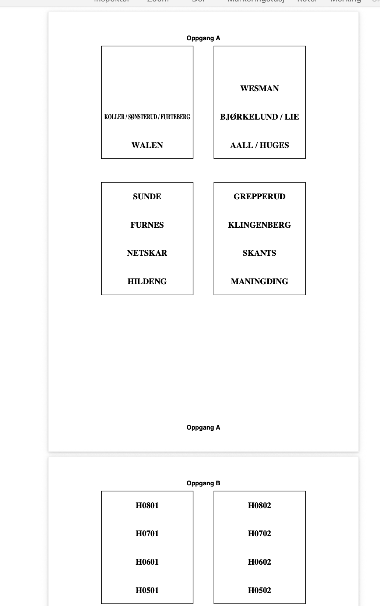

# Generator for porttelefonoversikten



## Eksempel på bruk
```
python3 generate_intercom_pdf.py intercom_sample.csv output.pdf
```

Gitt en CSV med leilighetsnummer og navnet du vil ha på ringeklokka får du da en PDF for utskrift.
Det er mulig man kanskje må justere litt på dimensjonene, som ligger i skriptet, avhengig
av hvordan porttelefonen fysisk er satt opp, f.eks. justere antall millimeter bredde og høyde på 
boksene som tegnes opp.

## Installasjon

Du må installere `uv` ([her](https://docs.astral.sh/uv/#installation)) og [`direnv`](https://direnv.net/) før du går i gang. Så er det
bare å zippe ned denne kodebrønnen/mappa og kjøre
```
uv sync
```

Ferdig.
